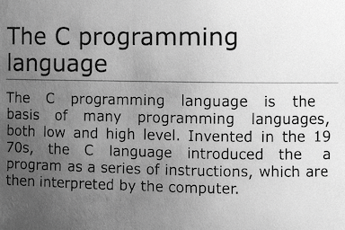
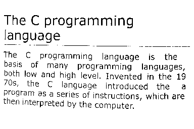

# FlatCV

Simple image processing and computer vision library in pure C.

"Simple" means:

- Color images are a flat array of RGBA row-major top-to-bottom
- Grayscale images are a flat array of GRAY row-major top-to-bottom
- Minimal usage of macros and preprocessor
- Available as an amalgamation where all code is combined into one file.
    (Each [release](https://github.com/ad-si/FlatCV/releases)
    includes a `flatcv.h` and `flatcv.c` file.)
- No fusing of image transformations


## Usage

FlatCV can either be used as a C library or via its CLI.
The CLI supports edit pipelines which sequentially apply all transformations.

```sh
flatcv <input> <comma-separated-edit-pipeline> <output>
```

As commas are not special characters in shells,
you can write the edit pipeline without quotes.
Both variants yield the same result:

```sh
flatcv i.jpg 'grayscale, blur 9' o.jpg
flatcv i.jpg grayscale, blur 9 o.jpg
```

Command | Output
--------|-------
`viu i.jpg` | 
`flatcv i.jpg grayscale o.jpg` | 
`flatcv i.jpg blur 9 o.jpg` | 
`flatcv i.jpg grayscale, blur 9 o.jpg` | 

Command | Output
--------|-------
`viu i.jpg` | 
`flatcv i.jpg bw_smart o.jpg` | 
`flatcv i.jpg bw_smooth o.jpg` | 


## FAQ

### Why is this written in C?

- **Most portable language** \
    Almost every other language has some support to integrate C code
    in one way or another.
    Especially since it's available a single file
    that can be vendored into your project.

- **Lot of existing code** \
    C and C++ are the most widely used languages for image processing.
    So there is a lot of existing code that can be reused and adapted.

- **Great for AI powered development** \
    As there is so much training data available,
    LLMs are especially good at writing C code.


### Will you rewrite this in another language?

I am open to rewrite this in [Rust](https://www.rust-lang.org)
or [Zig](https://ziglang.org) in the future,
once the advantages of C become less relevant.
