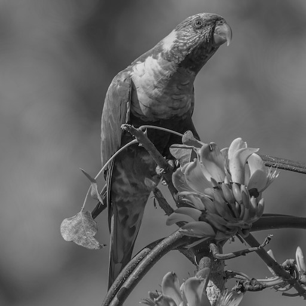
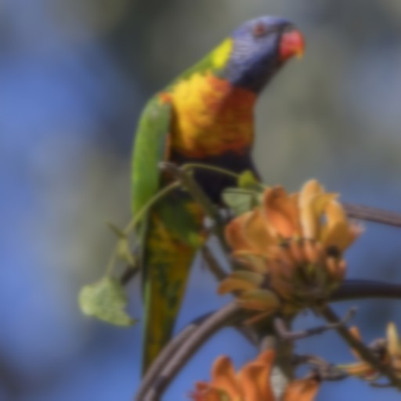

# FlatCV

Simple computer vision library in pure C.

"Simple" means:

- Color image is a flat array of RGBA row-major top-to-bottom
- Grayscale image is a flat array of GRAY row-major top-to-bottom
- No preprocessor usage
- No macros
- [WIP] Available as an amalgamation (all code combined into one file)

## Usage

FlatCV can either be used as a C library or via its CLI.
The CLI supports edit pipelines which sequentially applies all transformations.

Command | Output
--------|-------
`viu i.jpg` | 
`flatcv i.jpg grayscale o.jpg` | 
`flatcv i.jpg (blur 9) o.jpg` | 
`flatcv i.jpg grayscale (blur 9) o.jpg` | 
