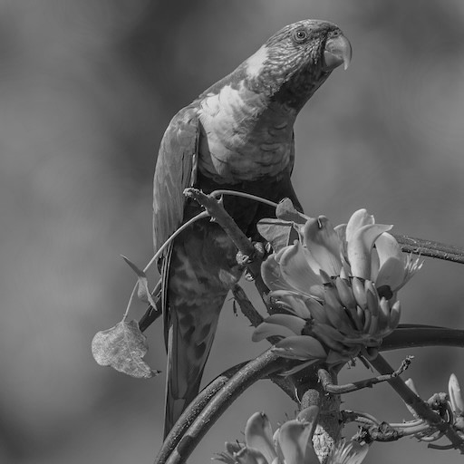
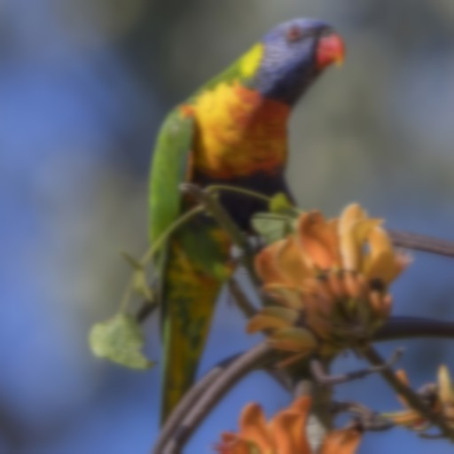
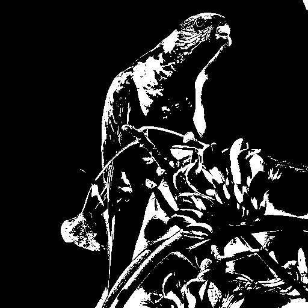

# FlatCV

Simple computer vision library in pure C.

"Simple" means:

- Color images are a flat array of RGBA row-major top-to-bottom
- Grayscale images are a flat array of GRAY row-major top-to-bottom
- No macros and preprocessor usage
- Available as an amalgamation where all code is combined into one file.
    (`flatcv.h` and `flatcv.c`)
- No fusing of image transformations


## Usage

FlatCV can either be used as a C library or via its CLI.
The CLI supports edit pipelines which sequentially apply all transformations.

```sh
flatcv <input> <comma-separated-edit-pipeline> <output>
```

As commas are not special characters in shells,
you can write the edit pipeline without quotes.
Both variants yield the same result:

```sh
flatcv i.jpg 'grayscale, blur 9' o.jpg
flatcv i.jpg grayscale, blur 9 o.jpg
```

Command | Output
--------|-------
`viu i.jpg` | 
`flatcv i.jpg grayscale o.jpg` | 
`flatcv i.jpg blur 9 o.jpg` | 
`flatcv i.jpg grayscale, blur 9 o.jpg` | 
`flatcv i.jpg bw_smart o.jpg` | 
