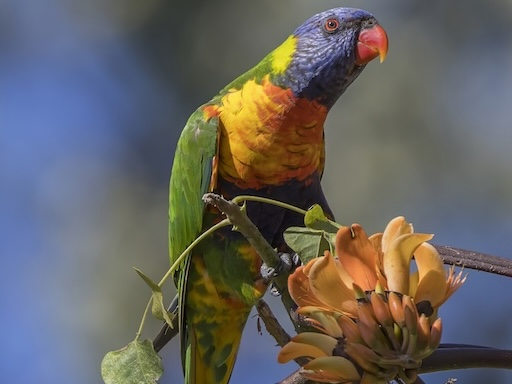
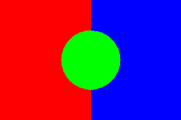

# FlatCV

Image processing and computer vision library in pure C.

<table>
  <tr>
    <td></td>
    <td></td>
    <td></td>
  </tr>
</table>


## Features

[Flip](https://flatcv.ad-si.com/flip.html),
[Crop](https://flatcv.ad-si.com/crop.html),
[Trim](https://flatcv.ad-si.com/trim.html),
[Resize](https://flatcv.ad-si.com/resize.html),
[Blur](https://flatcv.ad-si.com/blur.html),
[Draw](https://flatcv.ad-si.com/draw.html),
[Grayscale](https://flatcv.ad-si.com/grayscale.html),
[Binarize](https://flatcv.ad-si.com/binarize.html) \
[Corner-Detection](https://flatcv.ad-si.com/corner-detection.html),
[Segmentation](https://flatcv.ad-si.com/segmentation.html),
[Document-Extraction](https://flatcv.ad-si.com/document-extraction.html)

Check out the [official documentation][docs]
for more details on each feature.


## Usage

FlatCV can either be used as a C library or via its CLI.


### CLI

The CLI supports edit pipelines which sequentially apply all transformations.

```sh
flatcv <input> <comma-separated-edit-pipeline> <output>
```

As commas aren't special characters in shells,
you can write the edit pipeline without quotes.
Both variants yield the same result:

```sh
flatcv i.jpg 'grayscale, blur 9' o.jpg
flatcv i.jpg grayscale, blur 9 o.jpg
```


#### Examples

Check out the [official documentation website][docs]
for more examples and usage instructions.

Command | Input | Output
--------|-------|--------
`flatcv i.jpg grayscale o.jpg` |  | 
`flatcv i.jpg grayscale, blur 9 o.jpg` |  | 
`flatcv i.jpg bw_smooth o.jpg` |  | 
`flatcv i.jpg watershed 0x0 300x200 599x0 o.jpg` |  | 


### Library

```c
#include "flatcv.h"

// Resize an image to 50%
unsigned char const * half_size = resize(
  input_width, input_height,
  0.5, 0.5,
  &out_width, &out_height,
  input_data
);

// Do something with the resized image

free(half_size);
```

[docs]: https://flatcv.ad-si.com
