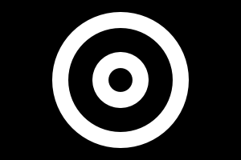

# CLI Documentation

## Resize

FlatCV uses area-based sampling for shrinking images
and bilinear interpolation for enlarging images.
This ensures a good balance between performance and quality.


### Percentage Resize (Half Size)

Input | Output
------|--------
 | 

```scrut
$ ./flatcv imgs/parrot.jpeg resize 50% imgs/parrot_resize_50_percent.jpeg
Loaded image: 512x384 with 3 channels
Executing pipeline with 1 operations:
Applying operation: resize with parameter: 50%
  → Completed in \d+.\d+ ms \(output: 256x192\) (regex)
Final output dimensions: 256x192
Successfully saved processed image to 'imgs/parrot_resize_50_percent.jpeg'
```


### Mixed Percentage Resize

Input | Output
------|--------
 | 

```scrut
$ ./flatcv imgs/parrot.jpeg resize 50%x150% imgs/parrot_resize_50x150_percent.jpeg
Loaded image: 512x384 with 3 channels
Executing pipeline with 1 operations:
Applying operation: resize with parameter: 50%x150%
  → Completed in \d+.\d+ ms \(output: 256x576\) (regex)
Final output dimensions: 256x576
Successfully saved processed image to 'imgs/parrot_resize_50x150_percent.jpeg'
```


### Absolute Size Resize

Input | Output
------|--------
 | 

```scrut
$ ./flatcv imgs/parrot.jpeg resize 800x400 imgs/parrot_resize_800x400.jpeg
Loaded image: 512x384 with 3 channels
Executing pipeline with 1 operations:
Applying operation: resize with parameter: 800x400
  → Completed in \d+.\d+ ms \(output: 800x400\) (regex)
Final output dimensions: 800x400
Successfully saved processed image to 'imgs/parrot_resize_800x400.jpeg'
```


### Resize Combined with Other Operations

Input | Output
------|--------
 | 

```scrut
$ ./flatcv imgs/parrot.jpeg grayscale, resize 50%, blur 2 imgs/parrot_gray_resize_blur.jpeg
Loaded image: 512x384 with 3 channels
Executing pipeline with 3 operations:
Applying operation: grayscale
  → Completed in \d+.\d+ ms \(output: 512x384\) (regex)
Applying operation: resize with parameter: 50%
  → Completed in \d+.\d+ ms \(output: 256x192\) (regex)
Applying operation: blur with parameter: 2.00
  → Completed in \d+.\d+ ms \(output: 256x192\) (regex)
Final output dimensions: 256x192
Successfully saved processed image to 'imgs/parrot_gray_resize_blur.jpeg'
```


## Crop

Input | Output
------|--------
 | 

```scrut
$ ./flatcv imgs/parrot.jpeg crop 200x150+100+100 imgs/parrot_crop.jpeg
Loaded image: 512x384 with 3 channels
Executing pipeline with 1 operations:
Applying operation: crop with parameter: 100.00 100.00 200.00 150.00
  → Completed in \d+.\d+ ms \(output: 200x150\) (regex)
Final output dimensions: 200x150
Successfully saved processed image to 'imgs/parrot_crop.jpeg'
```


## Grayscale Conversion

Input | Output
------|--------
 | 

```scrut
$ ./flatcv imgs/parrot.jpeg grayscale imgs/parrot_grayscale.jpeg
Loaded image: 512x384 with 3 channels
Executing pipeline with 1 operations:
Applying operation: grayscale
  → Completed in \d+.\d+ ms \(output: 512x384\) (regex)
Final output dimensions: 512x384
Successfully saved processed image to 'imgs/parrot_grayscale.jpeg'
```

```scrut
$ git diff --quiet imgs/parrot_grayscale.jpeg
```


## Gaussian Blur

Input | Output
------|--------
 | 

```scrut
$ ./flatcv imgs/parrot.jpeg blur 9 imgs/parrot_blur.jpeg
Loaded image: 512x384 with 3 channels
Executing pipeline with 1 operations:
Applying operation: blur with parameter: 9.00
  → Completed in \d+.\d+ ms \(output: 512x384\) (regex)
Final output dimensions: 512x384
Successfully saved processed image to 'imgs/parrot_blur.jpeg'
```

```scrut
$ git diff --quiet imgs/parrot_blur.jpeg
```


## Grayscale and Blur Combined

Input | Output
------|--------
 | 

```scrut
$ ./flatcv imgs/parrot.jpeg grayscale, blur 9 imgs/parrot_grayscale_blur.jpeg
Loaded image: 512x384 with 3 channels
Executing pipeline with 2 operations:
Applying operation: grayscale
  → Completed in \d+.\d+ ms \(output: 512x384\) (regex)
Applying operation: blur with parameter: 9.00
  → Completed in \d+.\d+ ms \(output: 512x384\) (regex)
Final output dimensions: 512x384
Successfully saved processed image to 'imgs/parrot_grayscale_blur.jpeg'
```

```scrut
$ git diff --quiet imgs/parrot_grayscale_blur.jpeg
```

## Black & White Conversion

### Smart Black & White

Input | Output
------|--------
 | 

```scrut
$ ./flatcv imgs/page.png bw_smart imgs/page_bw_smart.png
Loaded image: 384x256 with 1 channels
Executing pipeline with 1 operations:
Applying operation: bw_smart
  → Completed in \d+.\d+ ms \(output: 384x256\) (regex)
Final output dimensions: 384x256
Successfully saved processed image to 'imgs/page_bw_smart.png'
```

```scrut
$ git diff --quiet imgs/page_bw_smart.png
```


### Smart and Smooth (Anti-Aliased) Black & White

Input | Output
------|--------
 | 

```scrut
$ ./flatcv imgs/page.png bw_smooth imgs/page_bw_smooth.png
Loaded image: 384x256 with 1 channels
Executing pipeline with 1 operations:
Applying operation: bw_smooth
  → Completed in \d+.\d+ ms \(output: 384x256\) (regex)
Final output dimensions: 384x256
Successfully saved processed image to 'imgs/page_bw_smooth.png'
```

```scrut
$ git diff --quiet imgs/page_bw_smooth.png
```


## Drawing

### Circle

#### Single Red Circle

Input | Output
------|--------
 | 

```scrut
$ ./flatcv imgs/parrot.jpeg circle FF0000 50 200x150 imgs/parrot_circle_red.png
Loaded image: 512x384 with 3 channels
Executing pipeline with 1 operations:
Applying operation: circle with parameter: FF0000 200.00 150.00
  → Completed in \d+.\d+ ms \(output: 512x384\) (regex)
Final output dimensions: 512x384
Successfully saved processed image to 'imgs/parrot_circle_red.png'
```


#### Single Blue Circle

Input | Output
------|--------
 | 

```scrut
$ ./flatcv imgs/parrot.jpeg circle 0000FF 30 100x100 imgs/parrot_circle_blue.png
Loaded image: 512x384 with 3 channels
Executing pipeline with 1 operations:
Applying operation: circle with parameter: 0000FF 100.00 100.00
  → Completed in \d+.\d+ ms \(output: 512x384\) (regex)
Final output dimensions: 512x384
Successfully saved processed image to 'imgs/parrot_circle_blue.png'
```


#### Multiple Colored Circles

Input | Output
------|--------
 | 

```scrut
$ ./flatcv imgs/parrot.jpeg circle 00FF00 25 400x200, circle FFFF00 35 100x200 imgs/parrot_circles_multi.png
Loaded image: 512x384 with 3 channels
Executing pipeline with 2 operations:
Applying operation: circle with parameter: 00FF00 400.00 200.00
  → Completed in \d+.\d+ ms \(output: 512x384\) (regex)
Applying operation: circle with parameter: FFFF00 100.00 200.00
  → Completed in \d+.\d+ ms \(output: 512x384\) (regex)
Final output dimensions: 512x384
Successfully saved processed image to 'imgs/parrot_circles_multi.png'
```


#### Circle with Grayscale Conversion

Input | Output
------|--------
 | 

```scrut
$ ./flatcv imgs/parrot.jpeg grayscale, circle FFFFFF 40 250x250 imgs/parrot_gray_circle.png
Loaded image: 512x384 with 3 channels
Executing pipeline with 2 operations:
Applying operation: grayscale
  → Completed in \d+.\d+ ms \(output: 512x384\) (regex)
Applying operation: circle with parameter: FFFFFF 250.00 250.00
  → Completed in \d+.\d+ ms \(output: 512x384\) (regex)
Final output dimensions: 512x384
Successfully saved processed image to 'imgs/parrot_gray_circle.png'
```


#### Circle at Image Boundary

Input | Output
------|--------
 | 

```scrut
$ ./flatcv imgs/parrot.jpeg circle 00FFFF 80 10x10 imgs/parrot_circle_boundary.png
Loaded image: 512x384 with 3 channels
Executing pipeline with 1 operations:
Applying operation: circle with parameter: 00FFFF 10.00 10.00
  → Completed in \d+.\d+ ms \(output: 512x384\) (regex)
Final output dimensions: 512x384
Successfully saved processed image to 'imgs/parrot_circle_boundary.png'
```


### Disk

#### Single Red Disk

Input | Output
------|--------
 | 

```scrut
$ ./flatcv imgs/parrot.jpeg disk FF0000 50 200x150 imgs/parrot_disk_red.png
Loaded image: 512x384 with 3 channels
Executing pipeline with 1 operations:
Applying operation: disk with parameter: FF0000 200.00 150.00
  → Completed in \d+.\d+ ms \(output: 512x384\) (regex)
Final output dimensions: 512x384
Successfully saved processed image to 'imgs/parrot_disk_red.png'
```


#### Single Blue Disk

Input | Output
------|--------
 | 

```scrut
$ ./flatcv imgs/parrot.jpeg disk 0000FF 30 100x100 imgs/parrot_disk_blue.png
Loaded image: 512x384 with 3 channels
Executing pipeline with 1 operations:
Applying operation: disk with parameter: 0000FF 100.00 100.00
  → Completed in \d+.\d+ ms \(output: 512x384\) (regex)
Final output dimensions: 512x384
Successfully saved processed image to 'imgs/parrot_disk_blue.png'
```


#### Multiple Colored Disks

Input | Output
------|--------
 | 

```scrut
$ ./flatcv imgs/parrot.jpeg disk 00FF00 25 400x200, disk FFFF00 35 100x200 imgs/parrot_disks_multi.png
Loaded image: 512x384 with 3 channels
Executing pipeline with 2 operations:
Applying operation: disk with parameter: 00FF00 400.00 200.00
  → Completed in \d+.\d+ ms \(output: 512x384\) (regex)
Applying operation: disk with parameter: FFFF00 100.00 200.00
  → Completed in \d+.\d+ ms \(output: 512x384\) (regex)
Final output dimensions: 512x384
Successfully saved processed image to 'imgs/parrot_disks_multi.png'
```


#### Disk with Grayscale Conversion

Input | Output
------|--------
 | 

```scrut
$ ./flatcv imgs/parrot.jpeg grayscale, disk FFFFFF 40 250x250 imgs/parrot_gray_disk.png
Loaded image: 512x384 with 3 channels
Executing pipeline with 2 operations:
Applying operation: grayscale
  → Completed in \d+.\d+ ms \(output: 512x384\) (regex)
Applying operation: disk with parameter: FFFFFF 250.00 250.00
  → Completed in \d+.\d+ ms \(output: 512x384\) (regex)
Final output dimensions: 512x384
Successfully saved processed image to 'imgs/parrot_gray_disk.png'
```


#### Disk at Image Boundary

Input | Output
------|--------
 | 

```scrut
$ ./flatcv imgs/parrot.jpeg disk 00FFFF 80 10x10 imgs/parrot_disk_boundary.png
Loaded image: 512x384 with 3 channels
Executing pipeline with 1 operations:
Applying operation: disk with parameter: 00FFFF 10.00 10.00
  → Completed in \d+.\d+ ms \(output: 512x384\) (regex)
Final output dimensions: 512x384
Successfully saved processed image to 'imgs/parrot_disk_boundary.png'
```


#### Circle and Disk Combined

Input | Output
------|--------
 | 

```scrut
$ ./flatcv imgs/parrot.jpeg disk FF0000 60 250x250, circle FFFFFF 65 250x250 imgs/parrot_circle_disk_combo.png
Loaded image: 512x384 with 3 channels
Executing pipeline with 2 operations:
Applying operation: disk with parameter: FF0000 250.00 250.00
  → Completed in \d+.\d+ ms \(output: 512x384\) (regex)
Applying operation: circle with parameter: FFFFFF 250.00 250.00
  → Completed in \d+.\d+ ms \(output: 512x384\) (regex)
Final output dimensions: 512x384
Successfully saved processed image to 'imgs/parrot_circle_disk_combo.png'
```


## Corner Detection

### Detect Corners

```scrut
$ ./flatcv imgs/receipt.jpeg detect_corners
Loaded image: 1024x1024 with 3 channels
Executing pipeline with 1 operations:
Applying operation: detect_corners
  {
    "corners": {
      "top_left": [332.00, 68.00],
      "top_right": [692.00, 76.00],
      "bottom_right": [720.00, 956.00],
      "bottom_left": [352.00, 960.00]
    }
  }
  → Completed in \d+.\d+ ms \(output: 1024x1024\) (regex)
```

### Draw Corners

```scrut
$ ./flatcv imgs/receipt.jpeg draw_corners imgs/receipt_corners.png
Loaded image: 1024x1024 with 3 channels
Executing pipeline with 1 operations:
Applying operation: draw_corners
  Detected corners:
    Top-left:     (332.00, 68.00)
    Top-right:    (692.00, 76.00)
    Bottom-right: (720.00, 956.00)
    Bottom-left:  (352.00, 960.00)
  → Completed in \d+.\d+ ms \(output: 1024x1024\) (regex)
Final output dimensions: 1024x1024
Successfully saved processed image to 'imgs/receipt_corners.png'
```


## Segmentation

### Watershed

#### Watershed with 2 Markers for 1 White Ring

Input | Output
------|--------
 | 

The image is a white ring in the center of a black background.
Running the following watershed segmentation command segments the image into 2 regions:
- Disk in the center with a radius that goes to the middle of the rings edge
- The rest of the image

```scrut
$ ./flatcv imgs/elevation_2_basins_1_ring.png watershed 0x0 150x100 imgs/elevation_2_basins_1_ring_watershed.png
Loaded image: 300x200 with 1 channels
Executing pipeline with 1 operations:
Applying operation: watershed with parameter: 0x0 150x100
  → Completed in \d+.\d+ ms \(output: 300x200\) (regex)
Final output dimensions: 300x200
Successfully saved processed image to 'imgs/elevation_2_basins_1_ring_watershed.png'
```


#### Watershed with 2 Markers for 2 White Rings

Input | Output
------|--------
 | 

The image contains 2 white rings in the center of a black background.
Running the following watershed segmentation command segments the image into 2 regions:
- Disk in the center with a radius that goes to the middle of the black gap between the rings
- The rest of the image

```scrut
$ ./flatcv imgs/elevation_2_basins_2_rings.png watershed 0x0 150x100 imgs/elevation_2_basins_2_rings_watershed.png
Loaded image: 300x200 with 1 channels
Executing pipeline with 1 operations:
Applying operation: watershed with parameter: 0x0 150x100
  → Completed in \d+.\d+ ms \(output: 300x200\) (regex)
Final output dimensions: 300x200
Successfully saved processed image to 'imgs/elevation_2_basins_2_rings_watershed.png'
```


#### Watershed with 2 Markers for a Receipt

Input | Output
------|--------
 | 

The image contains the elevation map of a photo of a receipt.
Running the following watershed segmentation command segments the image into 2 regions:
- The receipt itself
- The background

```scrut
$ ./flatcv imgs/elevation_2_basins_receipt.png watershed 0x0 128x128 imgs/elevation_2_basins_receipt_watershed.png
Loaded image: 256x256 with 1 channels
Executing pipeline with 1 operations:
Applying operation: watershed with parameter: 0x0 128x128
  → Completed in \d+.\d+ ms \(output: 256x256\) (regex)
Final output dimensions: 256x256
Successfully saved processed image to 'imgs/elevation_2_basins_receipt_watershed.png'
```


#### Watershed with 3 Markers

Input | Output
------|--------
 | 

The image is a horizontal gradient from white to black and back to white.
There is also a white disk with black edge in the center.
Running the following watershed segmentation command segments the image into three regions:
- Left side
- Center
- Right side

```scrut
$ ./flatcv imgs/elevation_3_basins_gradient.png watershed 0x0 150x100 299x0 imgs/elevation_3_basins_gradient_watershed.png
Loaded image: 300x200 with 1 channels
Executing pipeline with 1 operations:
Applying operation: watershed with parameter: 0x0 150x100 299x0
  → Completed in \d+.\d+ ms \(output: 300x200\) (regex)
Final output dimensions: 300x200
Successfully saved processed image to 'imgs/elevation_3_basins_gradient_watershed.png'
```


## Document Extraction

### Extract Document with Auto-Sizing

Input | Output
------|--------
 | 

```scrut
$ ./flatcv imgs/receipt.jpeg extract_document imgs/receipt_extracted_auto.jpeg
Loaded image: 1024x1024 with 3 channels
Executing pipeline with 1 operations:
Applying operation: extract_document
  → Completed in \d+.\d+ ms \(output: \d+x\d+\) (regex)
Final output dimensions: \d+x\d+ (regex)
Successfully saved processed image to 'imgs/receipt_extracted_auto.jpeg'
```

### Extract Document to Specific Dimensions

Input | Output
------|--------
 | 

```scrut
$ ./flatcv imgs/receipt.jpeg extract_document_to 200x400 imgs/receipt_extracted.jpeg
Loaded image: 1024x1024 with 3 channels
Executing pipeline with 1 operations:
Applying operation: extract_document_to with parameter: 200.00 400.00
  → Completed in \d+.\d+ ms \(output: 200x400\) (regex)
Final output dimensions: 200x400
Successfully saved processed image to 'imgs/receipt_extracted.jpeg'
```


## Image Flipping

### Horizontal Flip (flip_x)

Input | Output
------|--------
 | 

```scrut
$ ./flatcv imgs/parrot.jpeg flip_x imgs/parrot_flip_x.png
Loaded image: 512x384 with 3 channels
Executing pipeline with 1 operations:
Applying operation: flip_x
  → Completed in \d+.\d+ ms \(output: 512x384\) (regex)
Final output dimensions: 512x384
Successfully saved processed image to 'imgs/parrot_flip_x.png'
```


### Vertical Flip (flip_y)

Input | Output
------|--------
 | 

```scrut
$ ./flatcv imgs/parrot.jpeg flip_y imgs/parrot_flip_y.png
Loaded image: 512x384 with 3 channels
Executing pipeline with 1 operations:
Applying operation: flip_y
  → Completed in \d+.\d+ ms \(output: 512x384\) (regex)
Final output dimensions: 512x384
Successfully saved processed image to 'imgs/parrot_flip_y.png'
```


### Both Flips Combined (180° Rotation)

Input | Output
------|--------
 | 

```scrut
$ ./flatcv imgs/parrot.jpeg flip_x, flip_y imgs/parrot_flip_both.png
Loaded image: 512x384 with 3 channels
Executing pipeline with 2 operations:
Applying operation: flip_x
  → Completed in \d+.\d+ ms \(output: 512x384\) (regex)
Applying operation: flip_y
  → Completed in \d+.\d+ ms \(output: 512x384\) (regex)
Final output dimensions: 512x384
Successfully saved processed image to 'imgs/parrot_flip_both.png'
```
